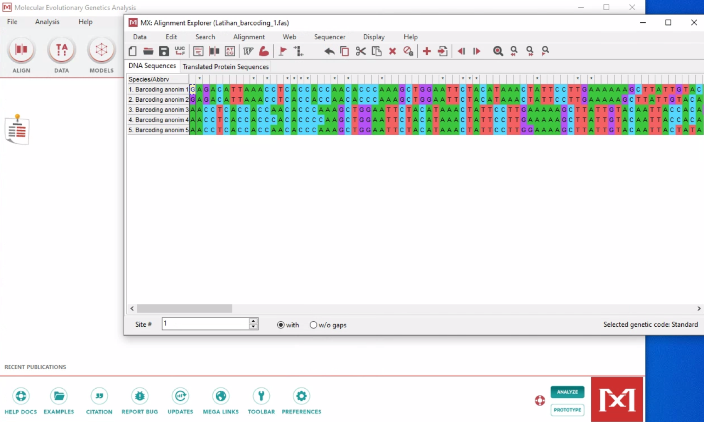
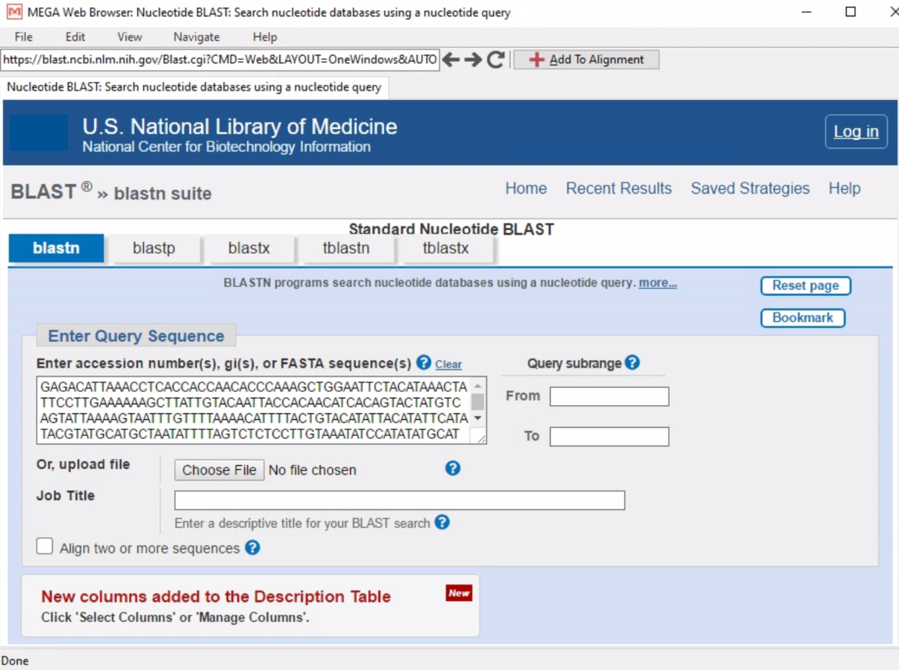
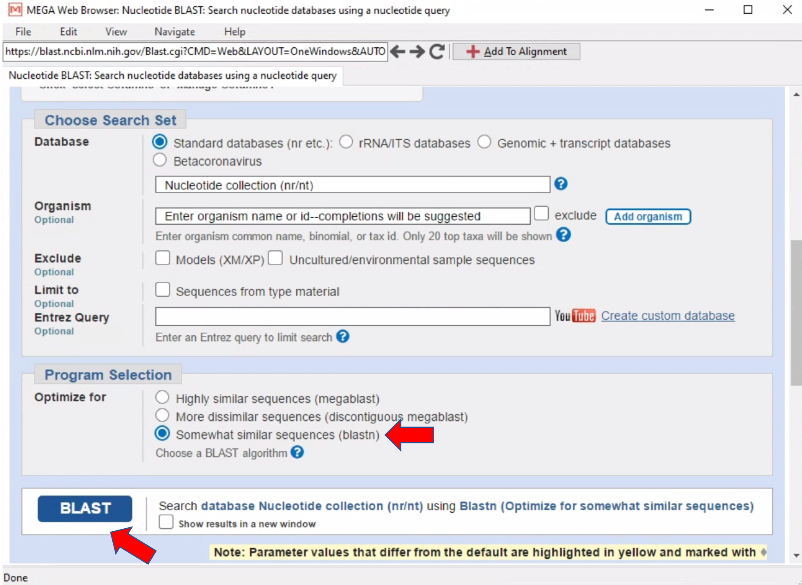
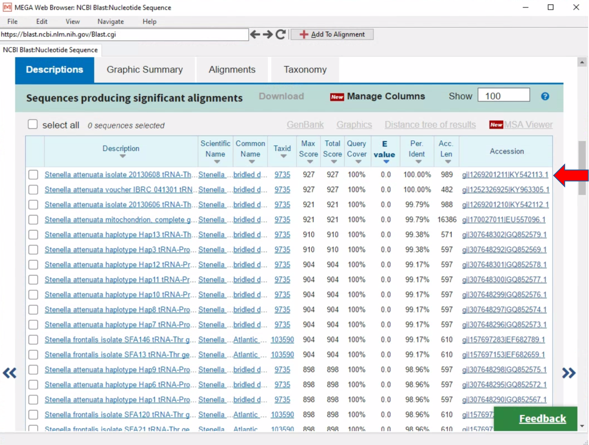
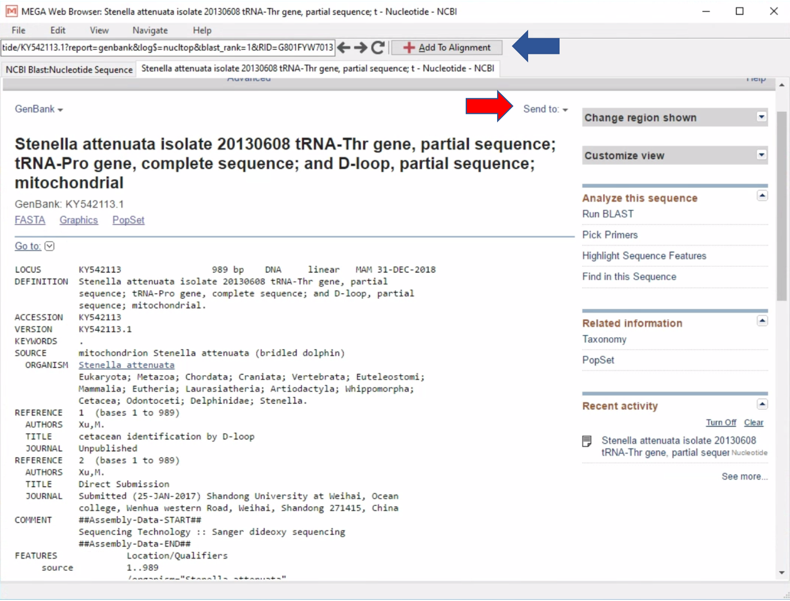
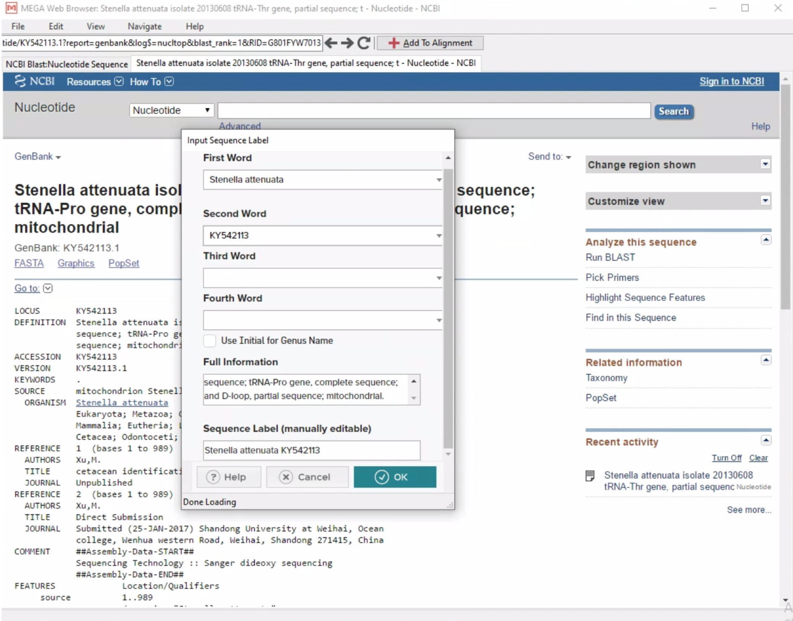

# DNA Barcoding

## Pendahuluan

**DNA Barcoding** adalah cara untuk mengidentifikasi organisme atau spesies menggunakan sekuen DNA pendek dari gen spesifik yang dipilih sesuai taxa yang diidentifikasi. Pada metode DNA Barcoding, sekuen pendek DNA dari gen tertentu akan diamplifikasi atau diperbanyak dengan metode PCR (*Polymerase Chain Reaction*). Kemudian, hasil sekuen akan dibandingkan dengan database untuk melihat kesamaan urutan sekuen sekaligus mengidentifikasi organisme atau spesies. Pada intinya, susunan DNA yang unik pada setiap organisme atau taxa, digunakan sebagai penanda spesifik atau “*Barcode*” untuk menentukan jenis organisme.

## Penanda

Analisis DNA Barcoding memerlukan penanda genetik atau *marker* yang sesuai dengan taxa yang akan diidentifikasi. Penanda genetik yang dipilih umumnya adalah gen yang bersifat *variable* (gen yang susunan DNA nya cenderung berubah-ubah melalui mutasi) untuk bisa membedakan satu organisme dengan organisme lainnya. Jika penanda genetik yang dipilih adalah lokus dari gen yang *conserved* atau jarang berubah, maka kemungkinan akan sulit mengidentifikasi atau membedakan spesies satu dengan spesies lainnya. Penanda genetik yang *conserved* umumnya adalah gen yang mengkode protein (*protein coding*), karena perubahan atau mutasi pada susunan DNA nya menyebabkan perubahan susunan protein yang dapat mengakibatkan perubahan regulasi protein pada tubuh yang kadang bersifat letal. Sebagai contoh, gen 16S rRNA. Penanda genetik ini merupakan gen yang *conserved* untuk mengidentifkasi eukaryote secara umum tetapi cukup variable bagi mikrobia. COI (*cytochrome c oxidase subunit 1*) merupakan penanda genetik yang cukup baik digunakan pada eukaryote, sedangkan untuk mikrobia adalah 16S rRNA (Hebert., et al. 2003a; Hebert., et al. 2003b; Bucklin., et al. 2011). Pada beberapa taxa, misalnya coral, penanda genetik terbaik adalah ITS (*Internal Transcribe Spacer*) dan untuk tumbuhan, DNA yang umumnya digunakan adalah *DNA chloroplast* (Lucas., et al. 2012; Nguyen., et al. 2015). Untuk itu, sebelum memulai penelitian menggunakan DNA Barcoding, salah satu hal pertama yang harus ditentukan adalah penanda genetik atau *marker* yang akan digunakan. 

## NCBI dan BLAST

Langkah pertama setelah mendapatkan sekuen yang telah di edit adalah membandingkan sekuen tersebut dengan database untuk menentukan jenisnya. Database yang umumnya digunakan adalah NCBI (*The National Center for Biotechnology Information*; https://www.ncbi.nlm.nih.gov). NCBI menyediakan database yang dapat diakses oleh publik dan mempunyai sebuah program yang disebut BLAST (*Basic Local Alignment Search Tool*; https://blast.ncbi.nlm.nih.gov/Blast.cgi). BLAST dikembangkan untuk menganalisa kesamaan antara sekuen-sekuen DNA. Program ini membandingkan sekuen nukleotida atau sekuen protein dengan sekuen yang tersedia di database dan mengkalkulasi signifikansinya secara statistik. 

## Kriteria Hasil BLAST :

* **E value** atau (*Expected Value*) adalah nilai yang menunjukkan berapa kali kita mengharapkan padanan yang didapat secara kebetulan antara *query sequence* (sekuen yang kita miliki atau kita masukkan) dengan sekuen target yang ada dalam database. Semakin kecil E value, semakin signifikan kesamaannya.
* **Percent Identity** adalah nilai yang menunjukkan seberapa sama sebuah *query sequence* dibandingkan dengan sekuen target pada database atau berapa banyak karakter yang identik pada kedua sekuen tersebut. Semakin tinggi *percent identity*, semakin signifikan kesamaannya.
* **Query Cover** adalah seberapa besar atau seberapa panjang kesesuaian *query sequence* dibandingkan dengan sekuen target pada database. Jika *query sequence*  memiliki kesesuaian sepanjang sekuen DNA taret (*covering target DNA)*, maka nilai dari *query cover* adalah 100%. 

## Analisis DNA Barcoding

* Disini disiapkan lima sekuen tanpa nama dalam bentuk fasta file (Latihan_barcoding_1.fas). Sekuen-sekuen tersebut memiliki panjang basa yang berbeda-beda dan sudah melalui proses editing. 
* Pertama, kita akan mengunggah fasta file tersebut ke dalam MEGA dengan cara klik: `Data – Open a File/Session – Pilih fasta file (Latihan_barcoding_1.fasta) – Open – Analyze or Align File? – Align` 
* **Catatan**: Untuk membandingkan sekuen ke NCBI, sekuen tidak perlu di sejajarkan (*Align*) dengan sekuen lainnya. Sekuen juga harus dihilangkan *gap*-nya. 

* Untuk membandingkan sebuah sekuen dengan sekuen dari NCBI, cukup klik sekuen yang akan dibandingkan (sekuen pertama: Barcoding anonim 1), lalu klik `BLAST selected sequence(s)` – Ini akan membawa kita ke halaman NCBI-BLAST. 

* Selanjutnya klik `Somewhat similar sequences (blastn) - klik tombol BLAST`. 

* Setelah ini, kita akan diberikan daftar dari sekuen- sekuen yang mirip dengan sekuen yang kita input (*query sequence*). 
* Sekuen yang berada paling atas, umumnya merupakan sekuen dari database yang memiliki kesesuian yang paling tinggi dengan *query sekuen kita*. 

* Untuk bisa melihat keterangan spesifik dari sekuen NCBI yang kita perbandingkan, cukup dengan klik di bagian *Accession number*, dan kita akan diarahkan ke halaman baru seperti gambar di bawah ini. 

* Sekuen tersebut dapat disimpan dalam bentuk file (tanda panah merah), atau diunduh langsung ke dalam *Allignment explorer* Mega dengan menekan **“Add To Alignment”** (tanda panah Biru). 
* Kita juga dapat mengganti atau menyingkat nama sekuen sesuai dengan yang kita inginkan.

* Setelah sekuen dari NCBI masuk ke dalam *Alignment Explorer* MEGA, kita dapat menyimpan data tersebut dalam Mega file atau Fasta file (Latihan_barcoding_1_edit.fas dan Latihan_barcoding_1_edit.meg).

Tahap selanjutnya dalam menganalisis data DNA barcoding adalah menghitung jarak genetik dan visualisasi data yang dapat ditunjukkan sebagai pohon filogenetic. Kita akan mengikuti alur seperti workshop sebelumnya tentang editing sekuen, tetapi dengan contoh data yang berbeda (Latihan_barcoding_2.fas).

## Tugas
Bukalah file “Tugas_barcoding_1.fasta”, kemudian lakukan BLAST terhadap masing-masing sekuen dan masukkan sekuen yang paling mirip dengan masing-masing sekuen ke dalam sebuah fasta file dan mega file (untuk ke-lima sekuen). Cobalah membuat jarak genetik (simpan dalam bentuk excel), dan pohon filogenetik menggunakan *Neighor Joining* (simpan dalam bentuk newick tree). Jika ada yang belum jelas, silakan menghubungi tim pengajar.

## Data citation:
Lihat halaman depan web ini untuk mendapatkan detail tentang hak cipta atau lihat di tautan berikut.

## References:
Bucklin A, Steinke D, Blanco-bercial L (2011) DNA Barcoding of Marine Metazoa. *Annu Rev Mar Sci* 3:471–508

Hebert PDN, Cywinska A, Ball SL, Jeremy R, B PRSL (2003a) Biological identifications through DNA barcodes. *Proc R Soc B Biol Sci* 270:313–321

Hebert PDN, Ratnasingham S, Waard JR De, B PRSL, Jeremy R (2003b) Barcoding animal life: cytochrome c oxidase subunit 1 divergences among closely related species. *Proc R Soc B Biol Sci* 270

Lucas C, Thangaradjou T, Papenbrock J (2012) Development of a DNA barcoding system for seagrasses: Successful but not simple. *PLoS ONE* 7(1): e29987

Nguyen XV, Höfler S, Glasenapp Y, Thangaradjou T, Lucas C, Papenbrock J (2015) New insights into DNA barcoding of seagrasses. *Syst Biodivers* 13(5):496-508

### How to cite this page?
Lihat halaman depan web ini untuk mendapatkan detail tentang hak cipta