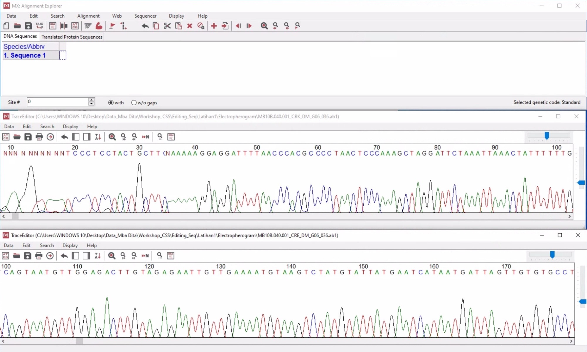
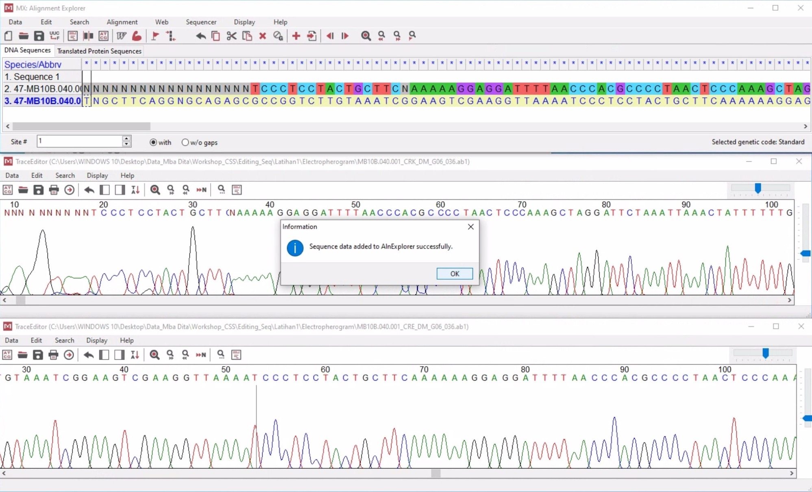
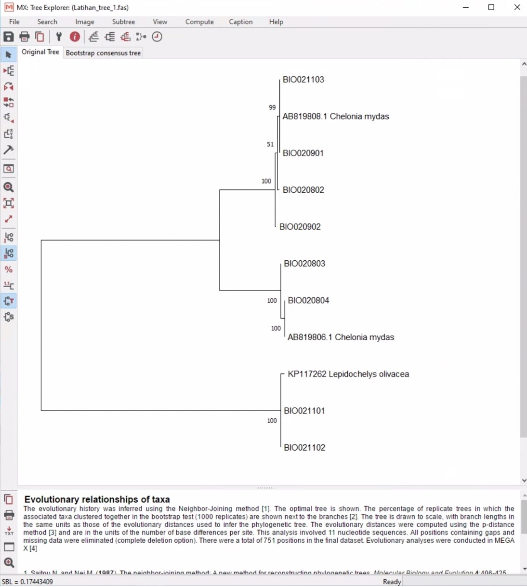
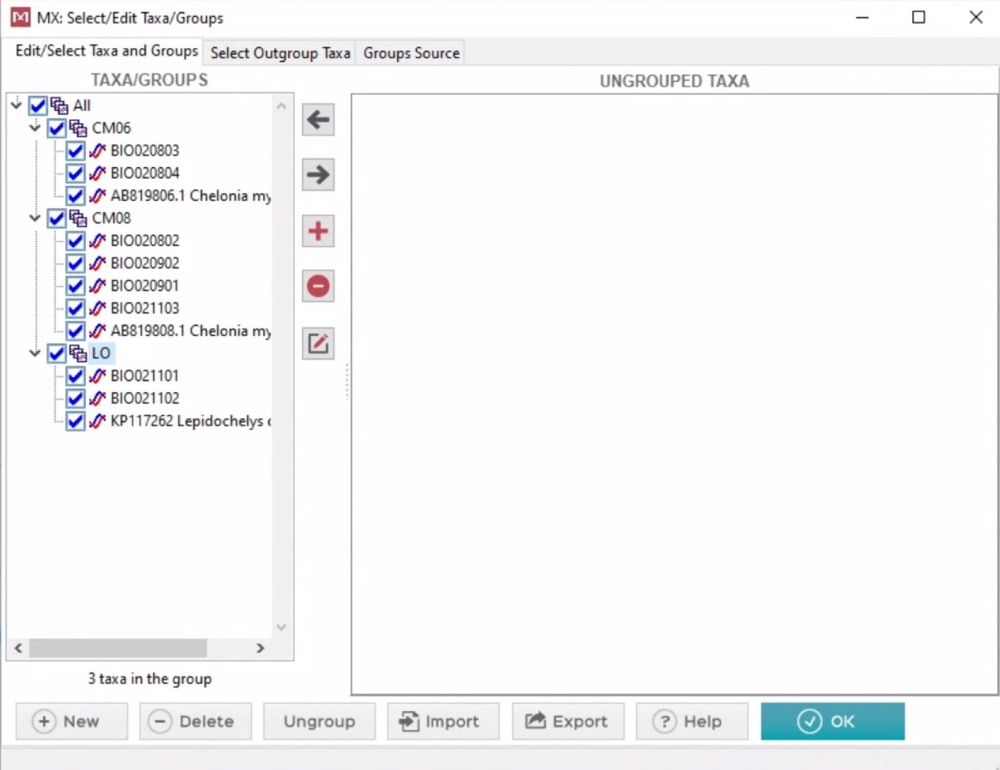

# Editing Sequences

## Pendahuluan

**MEGA** (https://www.megasoftware.net) merupakan salah satu *software* yang dapat diunduh secara gratis dan digunakan untuk melakukan editing sekuen hasil dari *Sanger Sequencing*, menghitung jarak genetik, dan membuat pohon filogeni. Software MEGA pertama kali dikembangkan oleh Masathosi Nei, Sudhir Kumar, dan Koichiro Tamura pada tahun 1993 (Kumar, et al., 1993). Saat ini, kita akan menggunakan MEGA X (Kumar, et al., 2018), sebagai platform untuk melakukan editing sekuen. Pada pendahuluan kali ini, kita akan mengenal beberapa istilah yang umumnya digunakan dalam editing sekuen.

## Jenis File

Hasil sekuensing yang kita terima dari *Sanger Sequencing Facility* berupa **“ab1 file”** yang berisi *electropherogram* dari sekuen DNA. *Electropherogram* memperlihatkan sekuen DNA yang berupa *“peak”* atau puncak diagram dengan empat warna berbeda yang merepresentasikan empat nukelotida (A, C, G, T) penyusun DNA. 

## Primers 

**Primer** adalah sekuen DNA tunggal yang pendek, umumnya berukuran 18-30 bp (*base pair* atau pasang basa) yang digunakan untuk meng-inisiasi atau mengawali pemanjangan sekuen DNA pada proses PCR (*Polymerase Chain Reaction*). Sekuen DNA primer bersifat *“complement”* dengan sekuen DNA yang akan diamplifikasi. Primer dalam PCR umumnya berjumlah sepasang, terdiri dari **Forward** (primer depan) dan **Reverse** (primer belakang).

## Reverse Complement

Sekuen DNA umumnya dibaca dari arah 5’ ke 3’. Sedangkan, primer belakang akan memulai pemanjangan dari 3’ ke 5’, sehingga sekuen yang dihasilkan akan terbaca dari 5’ ke 3’. Akan tetapi, jika di-*align* atau disejajarkan dengan hasil dari pemanjangan primer depan, sekuen dari primer belakang akan terlihat berbeda. Sehingga, untuk mensejajarkan hasil sekuen primer depan dan belakang sehingga menjadi satu sekuen yang identik, hasil sekuen dari primer belakang, harus di-**“reverse complement”**. Silakan lihat ilustrasi di bawah ini. 

## Jarak Genetik 

Jarak genetik atau *genetic distance* adalah jumlah perbedaan antara sekuen satu dengan sekuen lainnya. Jarak genetik juga digunakan untuk melihat perbedaan urutan sekuen antara sebuah kelompok  yang terdiri dari banyak individu.

## Pohon Filogeni 

**Pohon filogeni** adalah diagram percabangan yang menyerupai sebuah pohon bercabang yang digunakan untuk menggambarkan kekerabatan antar makhluk hidup. Dalam biologi molekuler, pohon filogeni dibuat berdasarkan persamaan atau perbedaan antara susunan DNA individu satu dengan individu lain. Pada analisis filogenetik yang menggunakan data sekuen atau urutan nukeotida, digunakan istilah OTU (*Operational Taxonomic Units*) sebagai cara lain untuk menyebutkan sebuah taxa (organisme, individu atau strain dari satu spesies atau spesies berbeda).

## Metode Rekonstruksi Pohon Filogeni:

* **Distance Method.** Distance Method atau metode jarak terdiri dari **Neighbor Joining** (NJ) dan **UPGMA** (*unweighted pair group method with arithmetic means*). Pada metode NJ, percabangan pohon phylogenetik dibuat berdasarkan jarak genetik antara sepasang sekuen. Metode ini merupakan metode rekonstruksi pohon filogenetik yang paling sederhana. Metode ini umumnya digunakan untuk membandingkan sample yang memiliki kekerabatan yang dekat. (Lemey et al., 2009) 
* **Maximun Likelihood (ML).** Metode ini lebih kuat dari NJ karena tidak hanya menghitung jarak genetik dari sekuen, tapi juga mempertimbangkan laju mutasi dan model evolusi dari tiap-tiap nukeotida. Metode ini umumnya digunakan untuk membuat pohon filogenetik bagi sample dengan kekerabatan pada level taxa yang beragam. Pada metode NJ dan ML, percabangan pada sebuah pohon dievaluasi dengan Teknik **“bootstrap resampling”**. Umumnya nilai bootstrap berkisar antara 0-100, dan semakin tinggi nilai bootstrap (>70), semakin yakin kita dengan percabangan pohon yang dibuat) 
* **Bayesian Method.** Metode Bayesian juga mengaplikasikan konsep dari Maximum Likelihood, akan tetapi, metode Bayesian tidak mencari satu pohon yang paling merepresentasikan hubungan kekerabatan dari sample, tetapi memakai distribusi dari banyak pohon yang dibuat. Metode Bayesian akan menghitung **posterior probability**, sebuah nilai yang memperkirakan seberapa *confidence* atau seberapa percaya kita terhadap percabangan sebuah pohon yang sekaligus menunjukkan *evolutionary relationship* dari sample. (Lemey et al., 2009)

## Mengedit Sequence

**1.	Mengedit dan menyimpan hasil editing**

* Untuk mengerjakan latihan pertama ini, sudah disediakan 5 pasang sekuen ikan karang pada folder `“Electropherogram”` dengan menggunakan primer D-loop mitochondria; CRA-CRE (Lee et al., 1995). CRA merupakan primer depan (TTCCACCTCTAACTCCCAAAGCTAG) dan CRE merupakan primer belakang (CCTGAAGTAGGAACCAGATG).
* Untuk memulai editing, buka program MEGAX, klik `Align - Edit/Build Alignment – Select an option: Create new allignemnet – Are you building DNA or protein sequence alignment? – Anwer: DNA`  Kita akan melihat Alignemnt Explorer yang kosong. 

*	Dari aligment explorer, kita akan View/Edit trace data from DNA sequences (ini untuk mengambil electropherogram)
*	Buka sepasang secara bersamaan dan tampilkan Alignment Explorer dan kedua electropherogram secara bersamaan 

* Klik `Edit - Reverse Compliment` pada electropherogram CRE. Kemudian masukkan masing-masing electropherogram ke Alignment Explorer dengan cara klik `Data – Add to alignemnt Explorer.` 

* Kemudian align atau sejajarkan  kedua sekuen dengan cara klik `Edit – Select All – kemudian klik tanda Align – Align DNA.`
* Dari sini, kita akan melihat banyak ketidaksamaan, misalnya panjang yang berbeda atau urutan nukleotida. Hal pertama yang bisa kita lakukan adalah menghapus “N”, kemudian melakukan editing dengan membandingkan sekuen tertentu atau motif tertentu pada alignment atau elektrophoregram. 
* Cara mencari motif sekuen tertentu adalah dengan mem-*block* motif yang diinginkan, lalu *copy-paste* ke electropherogram.
* Setelah proses pengeditan, kedua sekuen (sekuen depan dan sekuen belakang) akan digabungkan menjadi satu sekuen. 
* Proses dapat dilanjutkan ke pasangan sekuen selanjutnya. Sekuen yg sudah diedit biarkan di Allignemnt Explorer karena bisa jadi pembanding ketika di align.
* Ketika menutup electropherogram, jangan menyimpan perubahan yang telah kita lakukan, electropherogram harus tetap menjadi data mentah (*raw data*) yang dapat diedit berulang-ulang.

Hasil editing sekuen dapat disimpan dalam bentuk: 

* **Fasta**: ini dapat dibuka di notepad++ , dan paling umum serta dapat diaca di program2 editing sekuen lainnya. `(Latihan_editing_1.fas)`
* **Mega** file: tidak dalam bentuk sekuen yang bisa di edit, tapi dia dapat digunakan untuk melihat statistic di program mega `(Latihan_editing_1.meg)`
* Jadi sebaiknya simpan dalam bentuk fasta dan mega dengan nama file yang sama supaya aman.

**2.	Pembuatan Pohon Filogeni**

* Pada bagian ini kita akan menggunakan data yang sudah disediakan `(Latihan_tree_1.fasta)`. Data dalam bentuk fasta file dan sudah melewati proses editing.
* Pertama-tama, klik `Phylogeny – Construct/Test Neigbor-Joining Tree – Pilih file Latihan_tree_1.fasta – Open – Input Data Option: Nucleotida Sequences – Confirmation: Protein-coding nucleotide sequence data? – No` (karena kita tidak bekerja dengan protein-coding gene).
* Dari sini, kita akan diberikan beberapa parameter, kita akan set sesuai *default*.
* Data bisa disimpan sebagai mega file `(Latihan_tree_1.mtsx)` atau newick tree `(Latihan_tree_1.nwk)`. 

**3.	Menghitung jarak genetik (pairwise distance)**

* Untuk menghitung jarak genetic, pertama-tama kita klik `Distance – Compute Pairwise Distance – Buka file Latihan_tree_1.fas -  Open – Input Data Option: Nucleotida Sequences – Confirmation: Protein-coding nucleotide sequence data? – No` (pastikan sekuen sudah di-align).
* Dari sini, kita akan diberikan beberapa parameter, kita akan set sesuai default.
* Data dapat disimpan dalam bentuk excel sebagai `Latihan_distance_1.xls`

**4.	Menghitung jarak genetik antar group**

* Dari pohon filogeni yang sudah kita buat, terlihat ada dua spesies, *Chelonia mydas* dan *Lepidochelys olivacea*. Tapi, *Chelonia mydas* juga memperlihatkan 2 sub-group, untuk itu, kita akan membagi data menjadi 3 group.
* Buka `Latihan_tree_1.meg`  Klik `Data – Select Taxa and Groups – buat nama group baru dan masukkan masing-masing anggota group.`

* Open data, klik pada file mega, dan dari sana akan terlihat pengelompokan yang sudah kita buat

* Lalu lanjutkan dengan klik `Distance – Compute Within Group Mean Distance atau Compute Between Group Mean Distance` – buka file yang sudah terbuka di Mega - dari sini, kita akan diberikan beberapa parameter, kita akan set sesuai default.
* Data dapat disimpan dalam bentuk excel sebagai `Latihan_distance_2.xls`
* File mega yang sudah diberi group juga bisa disimpan sebagai` Latihan_tree_2.meg`

**5.	Lainnya**

* Selanjutnya kita dapat melihat komposisi nukelotida dengan membuka: `Latihan_tree_2.meg` dan melakukan beberapa analysis.
* Jika kita memiliki data pohon filogeni dalam bentuk mega tree session `(MTSX file)` kita bisa membukanya dalam Mega.
* Pada umumnya semua program pembuatan pohon dan editing pohon, bisa membaca newick tree. 
* Langkah langkah dalam protokol ini juga dapat di lihat pada link [berikut](https://www.youtube.com/watch?v=kYTkMTsgKJs)

## Data citation:

Data yang digunakan dalam latihan ini merupakan data yang sudah dipublikasikan pada: 

*	Allen, G.R., Erdmann, M.V, & Cahyani, N.K.D. (2018). Chrysiptera uswanasi, a new microendemic species of damselfish (Teleostei: Pomacentridae) from West Papua Province, Indonesia. Journal of the Ocean Science Foundation 31: 74-86.

*	Pertiwi, N.P.D., Suhendro, M.D., Yusmalinda, N.L.A., Putra, I.N.G., Putri,  I.G.R.M., Artinigsih, E.Y., Al-Malik, M.D., Cahyani, N.K.D., Sembiring, A. (2020) Forensic  genetic  case  study: Species  identification  and  traceability  of  sea  turtle  caught  in  illegal  trade  in  Bali, Indonesia. Biodiversitas 21:4276-4283

## References:

Kumar, S., K. Tamura, and M. Nei (1993) MEGA: Molecular Evolutionary Genetics Analysis. Ver. 1.0, The Pennsylvania State University, University Park, PA.

Lee WJ, Conroy J, Howell WH, Kocher TD (1995) Structure and evolution of teleost mitochondrial control regions. J Mol Evol 41:54–66

Lemey, P., Salemi, M., and Vandamme, A. (eds). 2009. The Phylogenetic Handbook: A Practical Approach to Phylogenetic Analysis and Hypothesis Testing. Cambridge University Press. 2nd edition. 750 pp.

Sudhir Kumar, Glen Stecher, Michael Li, Christina Knyaz, and Koichiro Tamura (2018) MEGA X: Molecular Evolutionary Genetics Analysis across computing platforms. Molecular Biology and Evolution 35:1547-1549

### How to cite this page?
Lihat halaman depan web ini untuk mendapatkan detail tentang hak cipta
