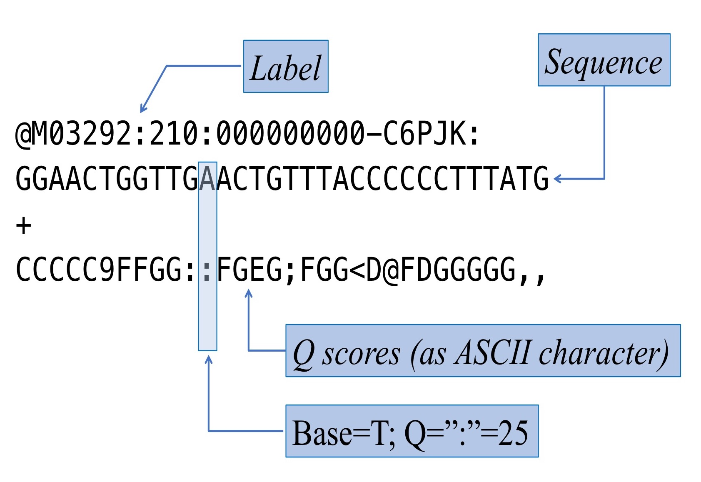
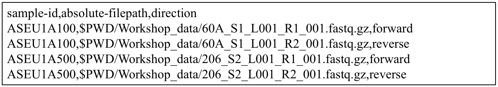
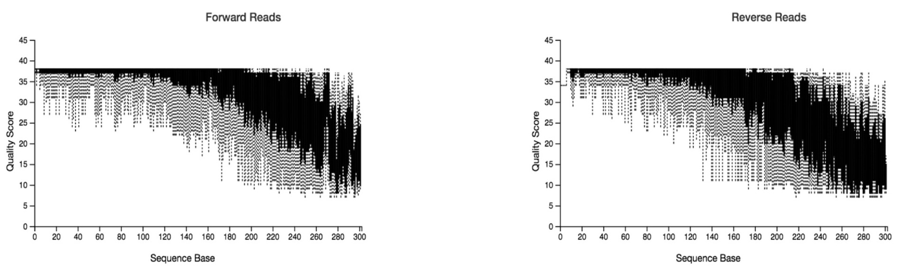

## QIIME2 Tutorial


Analisis bioinformatic merupakan tantangan baru dalam penelitian yang berbasiskan *Next Generation Sequencing (NGS)*. Pengolahan data sekuen DNA dalam jumlah besar memerlukan sarana dan prasarana yang memadai. Misalnya, dibutuhkan komputer dengan *memory* yang cukup besar untuk menyimpan data mentah, melakukan pengolahan data, menyimpan data yang sedang diolah dan meyimpan hasil akhir dari analisis. 

Tutorial kecil ini akan memperkenalkan langkah-langkah pengolahan data dari metode *NGS-DNA Metabarcoding*, dengan menggunakan pipeline QIIME2 (*the Quantitative Insights Into Microbial Ecology 2 program*, https://qiime2.org/) (Bolyen et al., 2018). Selanjutnya, ada banyak pipeline lain serta cara untuk melakukan *trouble shooting* yang tersedia di internet dan dapat di-akses secara bebas. Harapannya, dengan tutorial ini, kita dapat melakukan analisis secara langsung dengan data yang sederhana, sehingga para peneliti memiliki gambaran tentang apa itu analisis bioinformatika untuk kebutuhan penelitian berbasis NGS.

Sebelum melakukan analisis bioinformatika, ada beberapa hal yang harus diperhatikan atau menjadi catatan:

### 1. Primer

Primer atau *DNA marker* yang dipilih tentunya telah disesuaikan dengan pertanyaan riset. Primer akan menentukan pemilihan database pada proses *taxonomy assignment*, dan *threshold* atau batas persentase kesamaan yang digunakan dalam metode *clustering*. Pada umumnya untuk pada mikrobia dengan menggunakan marker 16S rRNA, *threshold* yang digunakan adalah 97% *identity* untuk dapat membedakan bakteria pada level genus. 97% *threshold* juga digunakan pada marker COI (*Cytochrome Oxidase subunit 1*). Latar belakang penggunakan 97% *threshold* adalah bahwa rata-rata, minimum dissimilarity antara spesies berdasarkan marker yang umum dipakai pada primer metabarcoding (misal: COI, 16S) adalah sekitar 3% (Hebert, Ratnasingham, Waard, B, & Jeremy, 2003). Sedangkan untuk 18S rRNA, *threshold* yang umumnya digunakan adalah 99%. 

Contoh kombinasi primer COI dengan Nextera-tail (Illumina primer) berdasarkan (Leray et al., 2013) yang telah digunakan untuk analisis metabarcoding pada invertebrata:

Ukuran produk sekuen: kurang lebih 380 bp (313 bp COI + 67 bp tails)

* **Forward**: i5 (F) NexTail	mlCOIintF
    + TCGTCGGCAGCGTCAGATGTGTATAAGAGACAG  GGWACWGGWTGAACWGTWTAYCCYCC
* **Reverse**: i7 (R) NexTail 	jgCOIR_
    + GTCTCGTGGGCTCGGAGATGTGTATAAGAGACAG  TAIACYTCIGGRTGICCRAARAAYCA

### 2. Paired atau Single end

Ini berhubungan dengan metode yang digunakan dalam mengamplifikasi sequence DNA pada proses PCR (*Polymerase Chain Reaction*). Sequence umumnya diamplifikasi dari dua arah atau memakai sepasang primer (*paired-end*). Akan tetapi, sekuen juga dapat diamplifikasi hanya dari satu arah dan memakai 1 primer (*single end*). 

### 3. Protokol laboratorium 

Protokol atau langkah-langkah yang dilakukan saat mempersiapkan sekuen (*library preparation*) sangat mempengaruhi langkah-langkah dalam melakukan analisis bioinformatika. Beberapa laboratorium memiliki pendekatan yang berbeda-beda dalam menyiapkan library. Salah satu contohnya adalah sistem *dual indexing*, dimana PCR dilakukan dua kali. PCR pertama memakai primer universal, seperti yang disebutkan di atas, lengkap dengan *Nextera barcode*-nya. Kemudian proses selanjutnya adalah menggabungkan beberapa sample menjadi satu (*multiplex*) dengan memberikan barcode yang unik pada tiap sample yang digabungkan. 

Dari protocol ini, yang harus diperhatikan adalah pencatatan identitas sample atau *sample_ID* yang konsisten, lengkap dengan barcode yang dipasangkan pada *sample_ID* tersebut, sehingga tidak terjadi kerancuan ketika sample di-unduh dari mesin sekuensing.

### 4. Mesin sekuensing dan Jenis Data  

Mesin sekuensing yang digunakan dalam riset NGS memiliki spesifikasi berbeda-beda. Mulai dari kemampuan menganalisis data, besar data yang ampu dianalisis, hingga reagen spesifik yang harus digunakan. Saat ini, umumnya NGS memakai *Illumina platform* yang memiliki reagen dan protocol yang cukup umum.

Berhubungan dengan analisis bioinformatika, pengetahuan tentang mesin sekuensing yang digunakan akan membantu kita menentukan parameter yang dipakai dalam proses analisis, misalnya berapa rata-rata error yang dihasilkan sebuah mesin. 

Hal lain yang perlu diketahui adalah bagaimana sebuah mesin sekuensing memproduksi data atau sekuen. Apakah sekuen masih dalam gabungan beberapa sekuen dengan barcoding berbeda? Apakah sekuen yang dihasilkan sudah di-*demultiplexed*? Atau apakah barcode dari primer sudah dihapus oleh mesin. Pengetahuan ini akan memudahkan kita dalam mempersiapkan langkah-langkah analisis bioinformatika.


## QIIME2 Pipeline

Qiime2 merupakan sebuah pipeline bioinformatika yang terintegrasi dan dibuat untuk menganalisa microbiome data. Data yang dihasilkan oleh Qiime2 disebut sebagai QIIME 2 *artifacts* (.qza) dan *visualization* file (.qzv). 

* *Qiime2 artifacts* berisi data dan metadata yang menjelaskan data bersangkutan, seperti tipe data, format data dan bagaimana data dibuat. 
* *Visualization* data adalah data yang dihasilkan untuk dapat divisualisasi melalui *Qiime2 view interaface* (https://view.qiime2.org/).

**Install qiime2**:
https://docs.qiime2.org/2020.2/install/
**Catatan:** cara meng-install Qiime2 pada windows dapat dilihat pada akhir tutorial ini.


## Langkah Analisis 


### 1.	Demultiplexing

Jika data mentah masih dalam bentuk gabungan beberapa sample atau *multiplexed*, maka kita perlu melakukan *demultiplexing* atau pemisahan data atau sampel menjadi individual sample. Pada proses ini yang diperlukan adalah *list barcode* yang digunakan sesuai dengan *sample_ID*.

Jika data mentah sudah dipisahkan kedalam individual sample, yang perlu diperhatikan adalah apakah data tersebut merupakan data dua arah (*paired-end*) atau satu arah (*single end*). Disini yang diperlukan adalah *manifest file* (.txt file) yang berfungsi mengidentifikasi sekuen yang unik.

Untuk lebih jelas, silakan masuk ke: https://docs.qiime2.org/2020.2/tutorials/moving-pictures/

Disini kita akan memakai contoh, 2 sampel yang dianalisis dari dua arah (*paired-end*). 

**Contoh** nama file data mentah yang dihasilkan oleh mesin Illumina sekuensing:

* 60A_S1_L001_R1_001.fastq.gz
* 60A_S1_L001_R2_001.fastq.gz
* 206_S2_L001_R1_001.fastq.gz
* 206_S2_L001_R2_001.fastq.gz
* **Catatan**:
    + 60A dan 206 adalah sample_ID
    + S1 dan S2 adalah kode yang dihasilkan mesin untuk menyatakan ini sample keberapa yang dianalisis mesin
    + R1 dan R2 adalah penanda arah amplifikasi (*forward* dan *reverse*)
    + Kita akan membuat folder “qiime2_workshop” dan didalamnya kita akan membuat folder “Workshop_data” untuk menyimpan semua sekuen.
    + Disini kita juga bisa melakukan cek secara manual dan random, apakah sekuen masih berisi primers atau tidak. 

**Fastq file**:

Fastq memiliki 4 baris, yang terdiri dari label atau *sequence identifier* di baris pertama; urutan sekuen di baris kedua; tanda + pada baris ketiga berfungsi sebagai separator; dan kualitas dari sekuen (*Phred scores* atau *Q scores*) di baris ke empat. *Q scores* disesuaikan dengan **ASCII standard** (*American Standard Code for Information Interchange*).  https://www.drive5.com/usearch/manual/quality_score.html



**Contoh manifest file**




**Catatan:**

* Kita akan mengubah sample_ID 60A menjadi ASEU1A100 dan 206 menjadi ASEU1A500
*	PWD (*print working directory*) untuk menuliskan *directory* dimana kita bekerja saat ini

Dari sini kita akan menggabungkan data menjadi *Qiime2 artifacts* file untuk bisa masuk ke tahap selanjutnya. Pada proses ini kita akan bekerja pada folder “qiime2_workshop” yang telah dipersiapkan. Pada proses ini, sample akan di *paired-end* dan kita bisa mengecek kualitas sekuen dari *visualization file*.

Data awal informasi yang perlu dimasukkan ke dalam folder kerja (folder “qiime2_workshop”) adalah manifest file (manifest_workshop.txt) dan informasi meta-data dari sampel tersebut (map_workshop.txt). 

Kita akan mulai dengan **cd** command yang akan membawa kita ke folder atau *directory* tempat kita bekerja. Pastikan juga jika Qiime2 sudah diaktifkan (misal dengan mengetik `$ conda activate qiime2-2020.2`).

```
qiime tools import \ 
  --type 'SampleData[PairedEndSequencesWithQuality]' \
  --input-path manifest_workshop.txt \
  --output-path paired-end-workshop.qza \
  --input-format PairedEndFastqManifestPhred33
``` 

kita bisa melihat arti setiap maksud dan tujuan command atau perintah kita terhadap qiime2 tersebut dengan menambahkan kata `--help` di akhir judul command perintah 

**Contoh:**
`qiime tools import --help`

Maka kita bisa mengetahui maksud arti dari perintah-perintah yang dibuat seperti `–-type`, `--input-path`, `--output-path`, `--input-format`. kita bisa melakukan `--help` tersebut kesemua judul perintah command kita

```
qiime demux summarize \
  --i-data paired-end-workshop.qza \ 
  --o-visualization paired-end-workshop.qzv
```

kita bisa melihat hasil visualisasi dari setiap format data .qzv melalui https://view.qiime2.org/, drag file tersebut kedalam web browser tersebut.

### 2. Quality control 

DADA2 (Callahan et al., 2016) merupakan sebuah pipeline yang dipakai untuk melakukan deteksi dan koreksi terhadap sekuen amplicon yang dihasilkan oleh Illumina platform. Pada proses ini akan dilakukan *quality control* yang akan mem-filter phiX reads serta mem-filter chimera. PhiX merupakan *single-stranded* DNA (ssDNA) virus yang digunakan secara komersial dalam proses sekuensing sebagai control positif.

Jika kita ingin potong primer sebelum proses DADA2, kita bisa memakai “cutadapt” (Martin, 2011). Kemudian di DADA2, kita beri `p-trim-left-f` dan `p-trim-left-r` nilai 0.

```
qiime cutadapt trim-paired \
  --i-demultiplexed-sequences paired-end-workshop.qza \
  --p-cores 8 \
  --p-front-f GGGWACWGGWTGAACWGTWTAYC \
  --p-front-r TAAACTTCAGGGTGACCAAARAA \
  --o-trimmed-sequences demux-trimmed-workshop.qza
```

```
qiime demux summarize \
  --i-data demux-trimmed-workshop.qza \
  --o-visualization demux-trimmed-workshop.qzv
```

Jika tidak, kita dapat langsung masuk ke DADA2 dan memberikan parameter panjang primer *forward* dan *reverse* yang akan dipotong. Parameter `trunc-len-f` dan `trunc-len-r` merupakan parameter “panjang sekuen” yang akan digunakan dan dipilih karena memiliki kualitas yang baik. Panjang sekuen yang akan dipotong ditentukan oleh visualization data pada analisis sebelumnya (“paired-end-workshop.qzv” atau “demux-trimmed-workshop.qv”).

 

Guna visualisasi data, pada proses ini kita akan membutuhkan metadata atau map.txt yang berisi keterangan tentang sample kita. Terlampir contoh dari map.txt.


```
qiime dada2 denoise-paired \
  --i-demultiplexed-seqs demux-trimmed-workshop.qza \
	--p-trim-left-f 0 \
	--p-trim-left-r 0 \
	--p-trunc-len-f 200 \
	--p-trunc-len-r 160 \
	--o-table table-dada2.qza \
	--o-representative-sequences rep-seqs-dada2.qza \
	--o-denoising-stats denoising-stats-dada2.qza \
	--p-n-threads 24
```

**Catatan**: DADA2 memakan waktu running yang agak lama; Pada protokol ini, kita lewati langkah ini dan gunakan data yang sudah disiapkan

```
qiime metadata tabulate \
  --m-input-file denoising-stats-dada2.qza \
  --o-visualization denoising-stats-dada2.qzv

qiime feature-table tabulate-seqs \
  --i-data rep-seqs-dada2.qza \
  --o-visualization rep-seqs-dada2.qzv

qiime feature-table summarize \
  --i-table table-dada2.qza \
  --m-sample-metadata-file map_workshop.txt \
  --o-visualization table-dada2.qzv
```

Visualisasi yang dihasikan:

* denoising-stats-dada2.qzv; rep-seqs-dada2.qzv; table-dada2.qzv. 
*	Beberapa istilah dalam table-dada2.qzv:
    + **Feature** adalah jumlah sekuence unik yang juga berkorelasi dengan jumlah taxa setelah melakukan *taxonomy assignment*.
    + **Frequency** adalah jumlah sekuen total atau sequence **reads**

### 3. Clustering

Proses clustering merupakan proses pengelompokan sekuen berdasarkan persentase kesamaannya. Proses ini akan menghasilkan *Operational Taxonomic Unit (OTU)*. Proses clustering dapat dilakukan dengan tiga pendekatan; *de novo, close reference dan open refence*. 

* **De novo**: pada proses ini sekuen atau reads diagabungkan antara satu dengan lainnya tanpa ada sekuen pembanding atau *reference sequence*.
* **Close reference**: sekuen dikelompokkan bedasarkan sekuen pembanding dan sekuen yang tidak memiliki pembanding, tidak akan digunakan dalam analisis. 
* **Open reference**: sekuen dikelompokkan berdasarkan sekuen pembanding, dan sekuen yang tidak memiliki pembanding akan dikelompokkan secara *de novo*. 

Pada contoh ini, kita akan menggunakan Vsearch pipeline (Rognes, Flouri, Nichols, Quince, & Mahé, 2016) untuk melakukan clustering dengan pendekatan *de novo*.

```
qiime vsearch cluster-features-de-novo \
--i-table table-dada2.qza \
--i-sequences rep-seqs-dada2.qza \
--p-perc-identity 0.97 \
--o-clustered-table merged-table-dada2-clustering.qza \
--o-clustered-sequences merged-rep-seqs-dada2-clustering.qza
```

```
qiime feature-table summarize \
--i-table merged-table-dada2-clustering.qza \
--o-visualization merged-table-dada2-clustering.qzv

qiime feature-table tabulate-seqs \
--i-data merged-rep-seqs-dada2-clustering.qza \
--o-visualization merged-rep-seqs-dada2-clustering.qzv
```

**Catatan:**

*	Selain pendekatan Clustering atau membuat OTU, saat ini juga ada pendekatan ASV (*Amplicon Sequence Variants*) (Callahan, McMurdie, & Holmes, 2017). Pendekatan ini menasumsikan setiap sekuen unik sebagai satu ASV. Dengan demikin jumlah ASVs akan lebih banyak daripada jumlah OTUs pada data yang sama.
*	Secara teknis, jika ingin menggunakan pendekatan ASVs, kita dapat melewatkan proses clustering dan memakai data hasil dari DADA2 sebagai data ASVs.

### 4. Taxonomy assignment

Taxonomy assignment adalah sebuah cara untuk membandingkan data sekuen yang dimiliki dengan database sekuen yang tersedia untuk mendapatkan taxonomy yang mendekati. 

Pada proses ini, diperlukan database yang telah dibuat khusus berdasarkan marker tertentu dan sudah melalui *peer review*. Beberapa contoh database dapat diunduh melalui: PR2 (https://pr2-database.org), SILVA (https://www.arb-silva.de/projects/eukaryotic-taxonomy), Midori (http://www.reference-midori.info/download.php, Wang et al., 2007)

Pada contoh ini, kita akan menggunakan database Midori (Leray, Ho, Lin, & Machida, 2018) sebagai pembanding terhadap data COI metabarcoding kita.

```
qiime feature-classifier classify-consensus-blast \
	--i-query merged-rep-seqs-dada2-clustering.qza \
	--i-reference-taxonomy MIDORI_LONGEST_20180221_COI_taxonomy.qza \
	--i-reference-reads MIDORI_LONGEST_20180221_COI.qza \
	--o-classification taxonomy.qza
```

```
qiime metadata tabulate \
  --m-input-file taxonomy.qza \
  --o-visualization taxonomy.qzv
```

### 5. Phylogenetic tree

```
qiime phylogeny align-to-tree-mafft-fasttree \
  --i-sequences merged-rep-seqs-dada2-clustering.qza \
  --o-alignment aligned-rep-seqs.qza \
  --o-masked-alignment masked-aligned-rep-seqs.qza \
  --o-tree unrooted-tree.qza \
  --o-rooted-tree rooted-tree.qza
```

### 6. Konversi hasil

```
qiime tools export \
--input-path merged-table-dada2-clustering.qza \
--output-path statistic

biom convert -i statistic/feature-table.biom -o statistic/otu_table.txt --to-tsv

qiime tools export \
--input-path unrooted-tree.qza \
--output-path statistic

qiime tools export \
--input-path taxonomy.qza \
--output-path statistic
```

Hasilnya adalah:

*	Folder statistic yang didalamnya terdiri dari file otu_table; tree.nwk; Taxonomy.tsv

### 7. Barplot

```
qiime taxa barplot \
  --i-table merged-table-dada2-clustering.qza \
  --i-taxonomy taxonomy.qza \
  --m-metadata-file map_workshop.txt \
  --o-visualization taxa-bar-plots.qzv
```

Hasil ini untuk melihat prosentasi taxonomic assigment dari  2 sampel ASEU1A100 dan ASEU1A500

### 8. Alpha and beta diversity

Pada proses ini kita akan menentukan `--p-sampling-depth`. Ini meupakan even sampling (i.e. rarefaction) depth. Nilai bisa kita lihat pada merged-table-dada2-clustering.qzv dan biasanya diambil nilai terendah dari reads/sekuen per sample.

**Catatan:**

*	Data yang digunakan disini disiapkan dalam folder “Step_8”
*	Jadi kita akan kerja di dalam folder ini, mulai dengan cd xxx/Step_8
*	Dalam map.txt, “Fraction size” harus dalam bentuk numerik, jadi “1” menunjukkan ukuran 100 um pada sample, “2” menunjukkan ukuran “500 um, dan “3” menunjukkan sessile sample.
*	Kita akan buat sampling depth menjadi 33.000

```
qiime diversity core-metrics-phylogenetic \
  --i-phylogeny rooted-tree.qza \
  --i-table merged-table-dada2-clustering.qza \
  --p-sampling-depth 33000 \
  --m-metadata-file map_workshop.txt \
  --output-dir core-metrics-results

qiime emperor plot \
  --i-pcoa core-metrics-results/unweighted_unifrac_pcoa_results.qza \
  --m-metadata-file map_workshop.txt \
  --p-custom-axes Fraction_Size \
  --o-visualization core-metrics-results/unweighted-unifrac-emperor-days-since-experiment-start.qzv

qiime emperor plot \
  --i-pcoa core-metrics-results/bray_curtis_pcoa_results.qza \
  --m-metadata-file map_workshop.txt \
  --p-custom-axes Fraction_Size \
  --o-visualization core-metrics-results/bray-curtis-emperor-days-since-experiment-start.qzv
```

### 9. Visualisasi

Untuk dapat melihat hasil analisis, silakan masuk ke https://view.qiime2.org/ dan masukkan file.qzv yang ingin di-visualisasi.

### 10. QIIME2 di OS windows

* Pastikan windows terintall sebagai Windows Subsytem Linux (WSL) 1 atau 2 (pilih salah satu saja). Note : WSL 2 lebih ter-update. Link tutorial install WSL 2 : https://www.youtube.com/watch?v=_fntjriRe48
* Setelah itu buka CMD (run as administrator), download file conda  melalui wget (ex: miniconda), link (https://docs.conda.io/en/latest/miniconda.html). Ketik kata seperti ini di CMD kita: wget https://repo.anaconda.com/miniconda/Miniconda3-latest-Linux-x86_64.sh
* Setelah di download gunakan WSL di CMD kita dengan ketik "bash" dan install file .sh miniconda yg telah di download. Ketik pada CMD kita: bash Miniconda3-latest-Linux-x86_64.sh
* Setelah terinstal silakan ketik "conda" pada CMD versi WSL kita apakah conda kita sudah terinstall. Jika sudah silakan install qiime2 melalui link https://docs.qiime2.org/2021.2/install/native/

Daftar Pustaka

Bolyen, E., Rideout, J. R., Dillon, M. R., Bokulich, N. A., Abnet, C., Ghalith, G. A. Al, … Naimey, A. T. (2018). QIIME 2 : Reproducible , interactive , scalable , and extensible microbiome data science. PeerJ. https://doi.org/10.7287/peerj.preprints.27295v2

Callahan, B. J., McMurdie, P. J., & Holmes, S. P. (2017). Exact sequence variants should replace operational taxonomic units in marker-gene data analysis. ISME Journal. https://doi.org/10.1038/ismej.2017.119

Callahan, B. J., McMurdie, P. J., Rosen, M. J., Han, A. W., Johnson, A. J. A., & Holmes, S. P. (2016). DADA2: High-resolution sample inference from Illumina amplicon data. Nature Methods, 13(7), 581–583. https://doi.org/10.1038/nmeth.3869

Hebert, P. D. N., Ratnasingham, S., Waard, J. R. De, B, P. R. S. L., & Jeremy, R. (2003). Barcoding animal life : cytochrome c oxidase subunit 1 divergences among closely related species Barcoding animal life : cytochrome c oxidase subunit 1 divergences among closely related species. https://doi.org/10.1098/rsbl.2003.0025

Leray, M., Ho, S. L., Lin, I. J., & Machida, R. J. (2018). MIDORI server: a webserver for taxonomic assignment of unknown metazoan mitochondrial-encoded sequences using a curated database. Bioinformatics (Oxford, England). https://doi.org/10.1093/bioinformatics/bty454

Leray, M., Yang, J. Y., Meyer, C. P., Mills, S. C., Agudelo, N., Ranwez, V., … Machida, R. J. (2013). A new versatile primer set targeting a short fragment of the mitochondrial COI region for metabarcoding metazoan diversity: application for characterizing coral reef fish gut contents. Frontiers in Zoology, 10(1). https://doi.org/10.1186/1742-9994-10-34

Martin, M. (2011). Cutadapt removes adapter sequences from high-throughput sequencing reads. EMBnet.Journal. https://doi.org/10.14806/ej.17.1.200

Murphy, K. and Macdonald, K. 2018. COI metabarcoding – Illumina DNA library preparation using two-step PCR. Laboratories of Analytical Biology. Smithsonian Institution National Museum of Natural History.

Rognes, T., Flouri, T., Nichols, B., Quince, C., & Mahé, F. (2016). VSEARCH: a versatile open source tool for metagenomics. PeerJ, 4. https://doi.org/10.7717/peerj.2584


