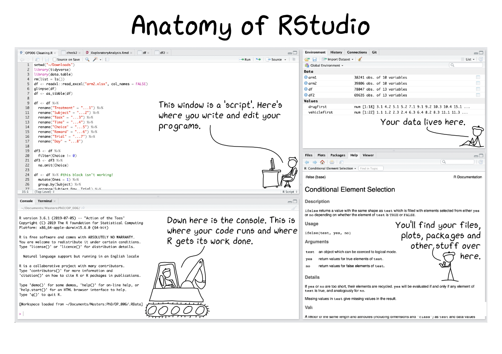
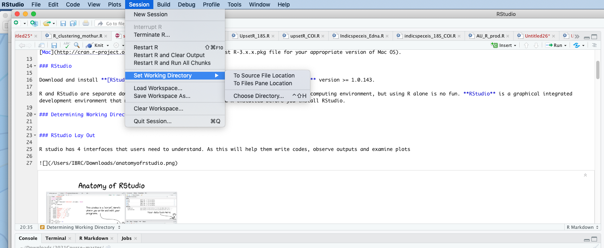
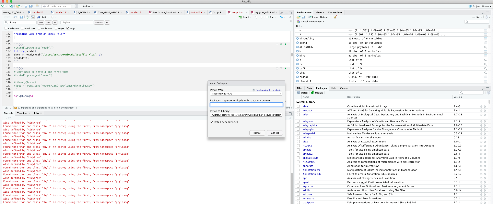
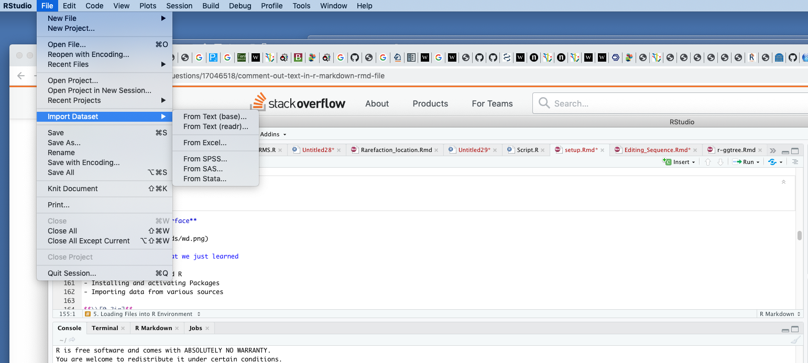
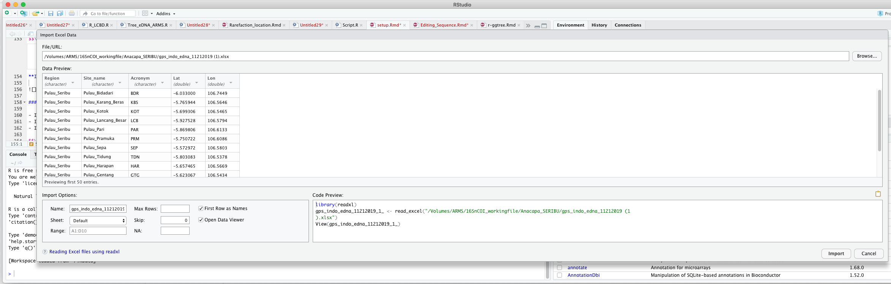
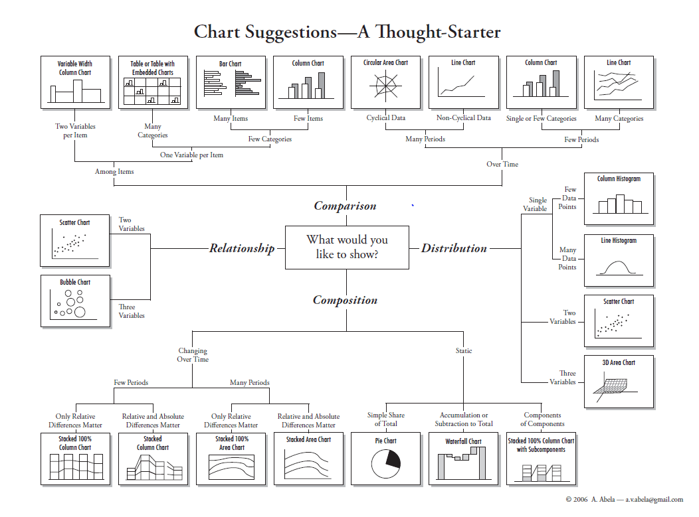
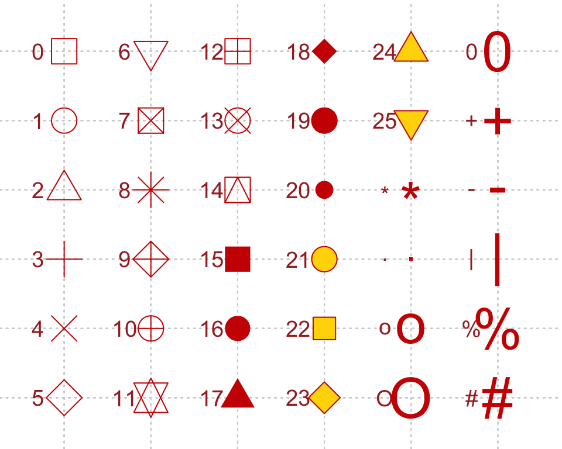
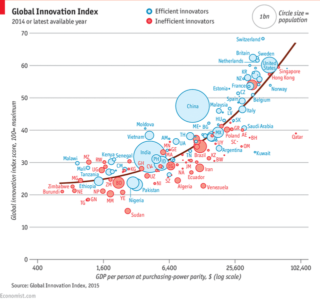

---
title: "Introduction to R"
output:
  html_document:
    df_print: paged
---

```{r, echo=FALSE}
options(repos = list(CRAN="http://cran.rstudio.com/"))
```
$$\\[0.1in]$$

### Sofware Installation

#### 1. Installing R

**Install R.** You'll need R version **3.4.0** or higher.[^rversion] Download and install R for [Windows](http://cran.r-project.org/bin/windows/base/) or [Mac](http://cran.r-project.org/bin/macosx/) (download the latest R-3.x.x.pkg file for your appropriate version of Mac OS).

#### 2. Installing RStudio

Download and install **[RStudio Desktop](https://www.rstudio.com/products/rstudio/download/)** version >= 1.0.143.

R and RStudio are separate downloads and installations. **R** is the underlying statistical computing environment, but using R alone is no fun. **RStudio** is a graphical integrated development environment that makes using R much easier. You need R installed before you install RStudio.

**Open your RStudio and see how it looks like** 

**R studio Interfaces** 

  

#### 3. Understanding R Components

**Two Components of R that we need to Understand**

1. Data and packages 
- A group of pre-made scripts that have been writen to answer or analyze specific type of questions or data
- Data from your observations
2. Syntax or script related with the packages
- Modifying scripts that suits your needs and the plots that you are about to produce


$$\\[0.1in]$$


### Working Directory

#### 3. Opening Rstudio and Determining Working Directory 



or through simple script   


```{r}
#setwd("/Users/IBRC/Downloads/2021Course-master")
```
$$\\[0.05in]$$


### Package installation and Activation
$$\\[0.05in]$$

#### 4. Installing packages from CRAN packages

Launch RStudio (RStudio, *not R itself*). Ensure that you have internet access, then copy and paste the following command into the **Console** panel (usually the lower-left panel, by default) and hit the Enter/Return key. 

**Skip this step, as many of you hopefully have done this before the course is started**

```r
#install.packages(c("tidyverse","ggplot2","ggtree", "dplyr", "gapminder","phylobase", "ape","remotes","readxl","gcookbook","haven","remotes"))
#remotes::install_github("YuLab-SMU/ggtree")
#library("ggtree"))

```

_A few notes_:

- Commands are case-sensitive. 
- You must be connected to the internet.
- The [tidyverse](http://tidyverse.org/) package is kind of a meta-package that automatically installs/loads many core packages that we use throughout the workshops.[^tidyverse]
- Even if you've installed these packages in the past, do re-install the most recent version. Many of these packages are updated often, and we may use new features in the workshop that aren't available in older versions.


<!-- [^tidyverse] Installing/loading the tidyverse **tidyverse** will install/load the core tidyverse packages that you are likely to use in almost every analysis:  -->

<!-- - **ggplot2** (for data visualisation)   -->
<!-- - **dplyr** (for data manipulation)    -->
<!-- - **tidyr** (for data tidying) -->
<!-- - **readr** (for data import) -->
<!-- - **purrr** (for functional programming) -->
<!-- - **tibble** (for tibbles, a modern re-imagining of data frames).  -->

**Find pacakges that suits your needs. This mostly can come from papers or publications in your fields or from R community through social media**

[^rversion]: R version 3.4.0 was released April 2017. If you have not updated your R installation since then, you need to upgrade to a more recent version, since several of the required packages depend on a version at least this recent. You can check your R version with the `sessionInfo()` command.


[^tidyverse]:It also installs a selection of other tidyverse packages that you're likely to use frequently, but probably not in every analysis (these are installed, but you'll have to load them separately with `library(packageName)`). This includes: **hms** (for times), **stringr** (for strings), **lubridate** (for date/times), **forcats** (for factors), **DBI** (for databases), **haven** (for SPSS, SAS and Stata files), **httr** (for web apis), **jsonlite** (or JSON), **readxl** (for .xls and .xlsx files), **rvest** (for web scraping), **xml2** (for XML), **modelr** (for modelling within a pipeline), and **broom** (for turning models into tidy data). After installing tidyverse with `install.packages("tidyverse")` and loading it with `library(tidyverse)`, you can use `tidyverse_update()` to update all the tidyverse packages installed on your system at once.

Check that you've installed everything correctly by closing and reopening RStudio and entering the following commands at the console window (don't worry about the _Conflicts with tidy packages_ warning):

$$\\[0.02in]$$
**Another way of Installing Packages**


$$\\[0.05in]$$

**4.1 Activating packages from CRAN packages**

```r
#library(c("tidyverse","ggplot2", "dplyr", "gapminder","phylobase", "ape","remotes","readxl","gcookbook","haven","remotes"))
```

This may produce some notes or other output, but as long as you don't get an error message, you're good to go. If you get a message that says something like: `Error in library(somePackageName) : there is no package called 'somePackageName'`, then the required packages did not install correctly. 

$$\\[0.2in]$$


#### 5. Importing and Exporting Files into R Environment 

**Loading Delimited Text Data File into R environment**

- Make sure you know the path of the your file or simply place the file on your working directory  

- See Following Example
```{r}
data <- read.csv("data/datafile.txt")
head (data) 

```

$$\\[0.2in]$$


**Loading Data from an Excel File**


```{r}
#install.packages("readxl")
library(readxl)
data <- read_excel("data/datafile.xlsx", 1)
head(data)
```

```{r}
# Only need to install the first time
#install.packages("haven")

#library(haven)
#data <- read_sav("/Users/IBRC/Downloads/datafile.sav")
```

$$\\[0.2in]$$

**Typing Data Manually from R Environment**


```{r}
data <- data.frame(x1 = c(1, 2, 3, 4),          
                  x2 = c(5, 6, 7, 8),
                  x3 = c(9, 10, 11, 12))
data
#write.table(data, file = "data.csv",sep="\t", row.names=FALSE)

```


$$\\[0.2in]$$
**Importing from R interface**

 


$$\\[0.1in]$$

#### Quick Review of what we just learned

- Installing Rstudio and R  
- Installing and activating Packages
- Importing data from various sources

$$\\[0.1in]$$

#### 6. Exploring data through plots


$$\\[0.2in]$$

#### 6.1 Exploring data through plots

**Making a Basic and Modified Scatter Plot**

```{r}
#install.packages(c("gcookbook","dplyr","ggplot2"))
library(gcookbook) # Load gcookbook for the heightweight data set
library(dplyr) # Load dplyr package
library(ggplot2)
data(heightweight)
heightweight=select(heightweight,ageYear, heightIn)
ggplot(heightweight, aes(x = ageYear, y = heightIn)) + 
geom_point() +
ggtitle("Basic R Scatter Plot") + 
theme(plot.title = element_text(hjust = 0.5))
```
$$\\[0.1in]$$


```{r}

ggplot(heightweight, aes(x = ageYear, y = heightIn)) + geom_point(shape = 21) +
  ggtitle("Basic R Scatter Plot With Different Shape") + 
  theme(plot.title = element_text(hjust = 0.5))
```
$$\\[0.2in]$$

**Shapes and its associated numbering category**


 <b>Image Credits - Fig.2 - 4K Mountains Wallpaper</b>

$$\\[0.2in]$$

```{r}
ggplot(heightweight, aes(x = ageYear, y = heightIn)) + geom_point(size = 4) +
    ggtitle("Basic R Scatter Plot With Bigger Point Size") + 
    theme(plot.title = element_text(hjust = 0.5))

```
$$\\[0.2in]$$

```{r}
data(heightweight)
ggplot(heightweight, aes(x = ageYear, y = heightIn, shape = sex, colour = sex)) + geom_point(size = 3) + 
  ggtitle("Scatter Plot With Colour Based on Factors") + theme(plot.title = element_text(hjust = 0.5))

```

$$\\[0.2in]$$
**Creating Unique Plot in R**

A plot example as published in the economist 



```{r}
library(gapminder)
library(dplyr)
library(ggplot2)

data(gapminder)
head(gapminder)
data <- gapminder %>% filter(year=="2007") %>% dplyr::select(-year)
head(data)

# Most basic bubble plot
ggplot(data, aes(x=gdpPercap, y=lifeExp, size = pop)) + 
geom_point(alpha=0.7)

```

```{r}
# Most basic bubble plot

data %>% arrange(desc(pop)) %>% mutate(country = factor(country, country))
data %>%
  arrange(desc(pop)) %>% # Arrange population as descending 
  mutate(country = factor(country, country)) %>% #creating and converting "country" into factor
  ggplot(aes(x=gdpPercap, y=lifeExp, size = pop)) + # Deciding x and y axes
    geom_point(alpha=0.5) +
    scale_size(range = c(.1, 15), name="Population (M)") # maximum circle size
```

```{r}
# Adding fourth dimension and embed colour

data %>% arrange(desc(pop)) %>% mutate(country = factor(country, country))
data %>%
  arrange(desc(pop)) %>% # Arrange population as descending 
  mutate(country = factor(country, country)) %>% #creating and converting "country" into factor
  ggplot(aes(x=gdpPercap, y=lifeExp, size = pop, color=continent)) + # Deciding x and y axes
    geom_point(alpha=0.5) +
    scale_size(range = c(.1, 24), name="Population (M)")
```


