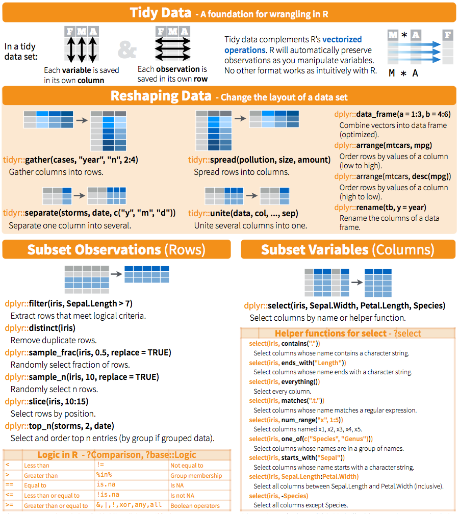
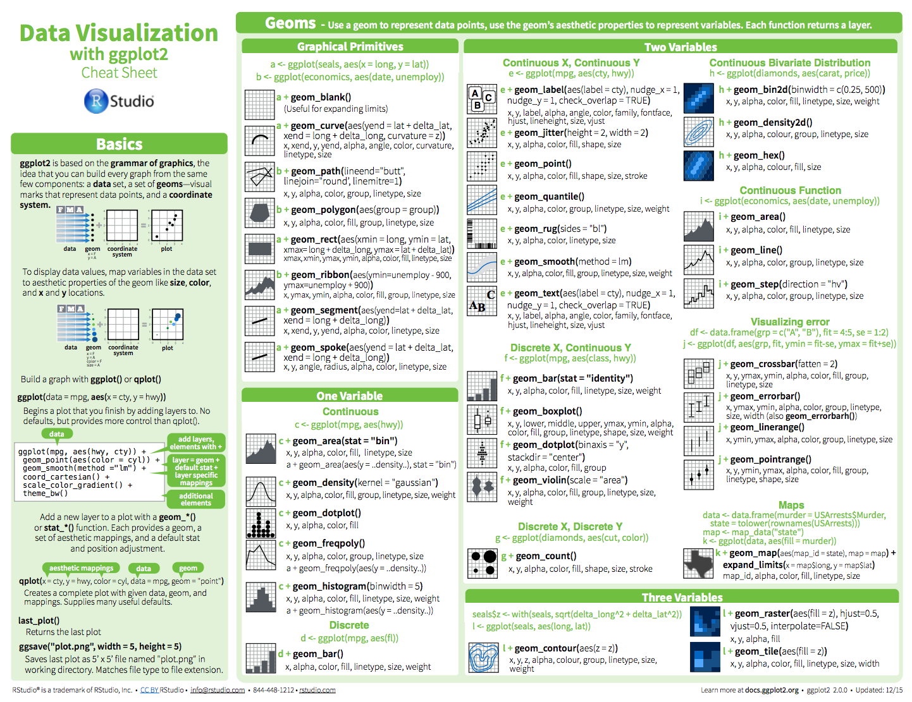
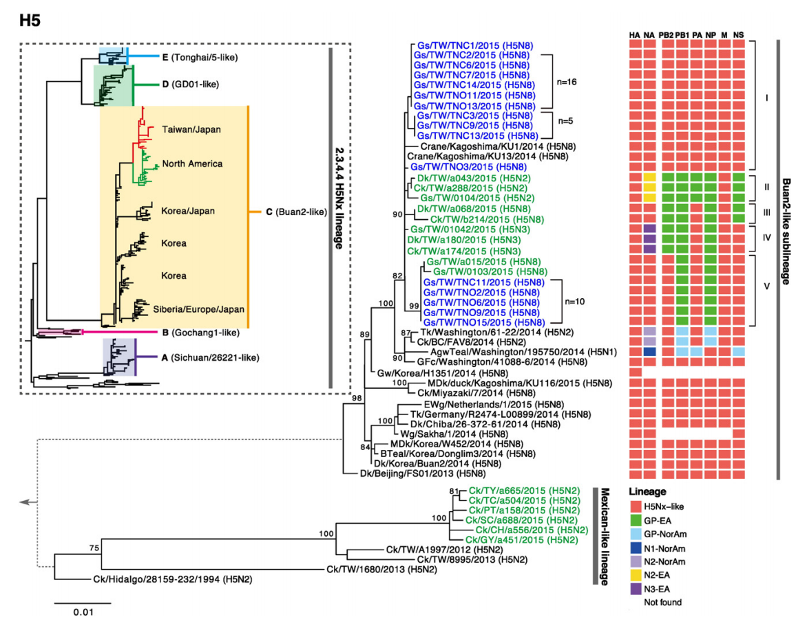

```{r setup, include=FALSE}
knitr::opts_chunk$set(echo = FALSE)
```

## Logistics

### Meetings

Date | Time
---------|---------
Weds, June 14  | 8:30am - 5:00pm
Thurs, June 15 | 8:30am - 12:00pm
Weds, June 21  | 8:30am - 5:00pm
Thurs, June 22 | 8:30am - 12:00pm


### Instructor

Stephen Turner (Bioinformatics Core Director, PHS)  
<turner@virginia.edu>

### Course Website

**[git.io/4va](http://git.io/biodatasci)**

## Agenda

### Core curriculum

1. Intro to R
1. Advanced Data Manipulation & Tidy Data
1. Reproducible Research & Dynamic Documents
1. Advanced Data Visualization with ggplot2
1. Visualizing and annotating phylogenetic trees
1. Introduction to RNA-seq data analysis

### Optional lessons

1. Essential Statistics

## Session 1: Intro to R

Novice-level introduction to the R, RStudio, and basic functionality such as creating variables, getting help, using data frames, basic plotting, and reading/writing files.

**Why R?**

- Free
- Huge community support
- 10,000+ free add-on packages
- [Bioconductor](http://bioconductor.org): huge resource for bioinformatics-specific functionality, packages, data, ...
- [Amazing graphics](https://www.google.com/search?q=ggplot2&tbm=isch)
- Reproducible research (Optional session #1)
- Tons of resources ([StackOverflow](http://stackoverflow.com/questions/tagged/r), [Coursera](https://www.coursera.org/specializations/jhu-data-science), ...)

## Session 2: Advanced Data Manipulation & Tidy Data

**[Janitor work](https://www.nytimes.com/2014/08/18/technology/for-big-data-scientists-hurdle-to-insights-is-janitor-work.html):** Filtering, reshaping, subsetting, split-apply-combine, joining, etc.



## Session 3: Reproducible Research & Dynamic Documents {.bigger}

- What's reproducible research all about?
- How to do it with **[RMarkdown](http://rmarkdown.rstudio.com/)**.

## Session 4: Advanced Data Visualization with ggplot2



## Session 5: Phylogenetic trees with ggtree

- Google image search "ggtree"



## Session 6: Introduction to RNA-seq Data Analysis

1. Our data: source, pre-processing, structure
1. Importing & exploring
1. Processing and analysis with [DESeq2](http://bioconductor.org/packages/DESeq2)
    - Structuring the count data and metadata
    - Running the analysis (normalization, dispersion estimation, model fitting)
    - Extracting results
1. Data visualization
1. Alternative approaches
1. Pathway analysis


## Elective 1: Essential Statistics

1. Descriptive statistics & Exploratory data analysis (EDA)
1. Continuous variable statistics
    - T-tests
    - Wilcoxon / Mann-Whitney U tests
    - ANOVA
    - Linear models & multiple regression
1. Discrete variable statistics
    - Contingency tables
    - Chi-square & Fisher exact tests
    - Logistic regression
1. _If time allows_: Power & sample size analysis
1. _Bonus_: Model tidying and extraction
